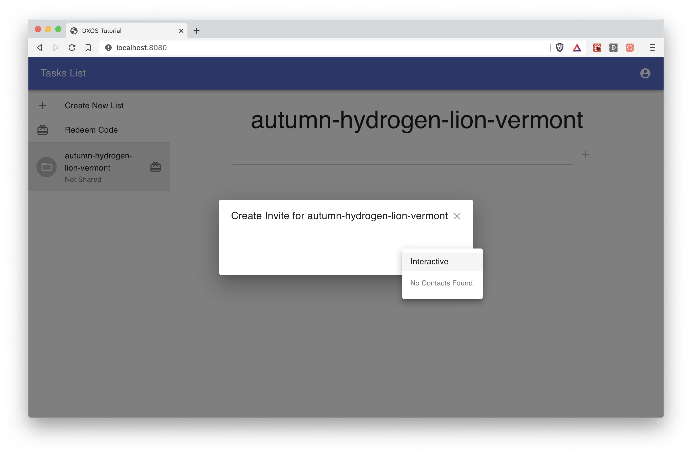
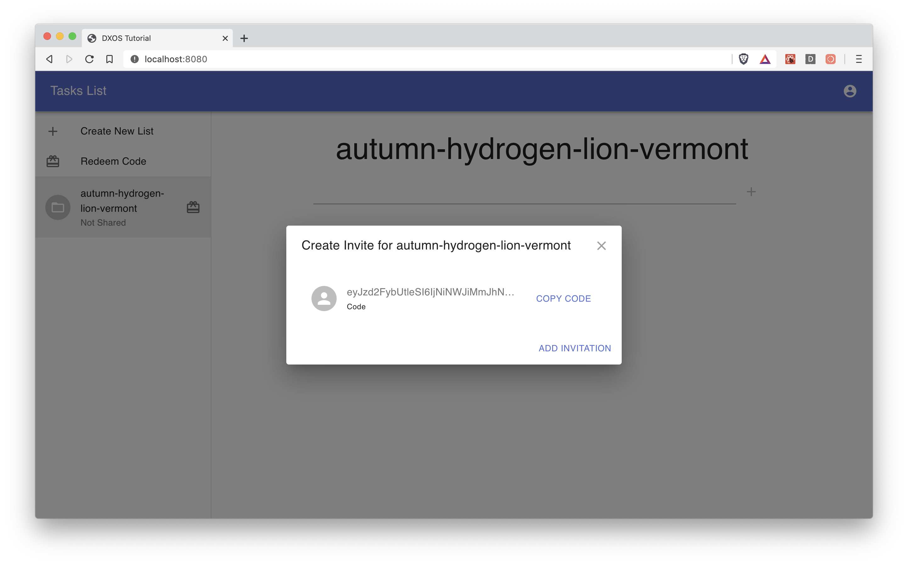

Before we can share the data we create in a party, we have to invite or grant access to othe peers into the party. There are 2 steps required in this proces: Create an invitation and then redeem it.

## Create Invitations

We have to create an invitation code that we will share with the peer we want to invite. This process is called *interactive* since it requires the invitee to redeem the invitation code and also provide a pin code that will be generated once the invitation is redeemed.

The `containers/Invite.js` defines the InvitationDialog. This component will present a Dialog to create new invitations. The `Invite` component receives the `party` an it generates the invitation code by using `useInvitation` hook.

```js
function Invite ({ party }) {
  const classes = useStyles();
  const [done, setDone] = useState(false);
  const [inviteCode, pin] = useInvitation(party, { onDone: () => { setDone(true) } });
  
  const ItemText = pin ? PinItemText : CodeItemText;

  //...

```



At this stage, we have the `inviteCode` which is the code we have to share with the peer we want to invite. 



As mentioned before, this process is interactive. Once the code is redeemed by the peer, we will get notified and the `pin` value will be available. The peer will be required to enter the `pin` value to finish the invitation process.

In the code, we show the `inviteCode` till the `pin` is available and then switch and display the `pin` code.


## Redeem

The redeem Dialog is defined in `containers/Redeem`. We use the `useInvitationRedeemer` hook to process the invitation code and then set the pin number:

```js
export default function RedeemDialog ({ onClose, ...props }) {
  const [redeemCode, setPin] = useInvitationRedeemer({ onDone: onClose });
  const [step, setStep] = useState(0);
  const [invitationCode, setInvitationCode] = useState('');
  const [pinCode, setPinCode] = useState('');

  const handleEnterInvitationCode = async () =>  {
    redeemCode(invitationCode);
    setStep(1);
  };

  const handleEnterPinCode = async ()  => {
    setPin(pinCode);
  }

  // ...
```

The redeem process consists of 2 steps, redeem code then validate the pin number. The Dialog displays a simple form with a text area to introduce the invitation code, this is saved in a state variable `invitationCode`.
The `handleEnterInvitationCode` is attached to a click button, the user enters the code provided by the other peer, and press the send button. The `invitationCode` is passed to `redeemCode` function. 

// IMAGE OF REDEEM DIALOG STEP 0

Then we switch to the next step and display a input field to provide the pin number and store it in the `pinCode` state variable. Once the user press the send button, we call the `setPin` passing the `pinCode` value. If all goes well, then `onDone` will be called.


## Offline Invitations

// TODO


## Handling Errors

// TDB

